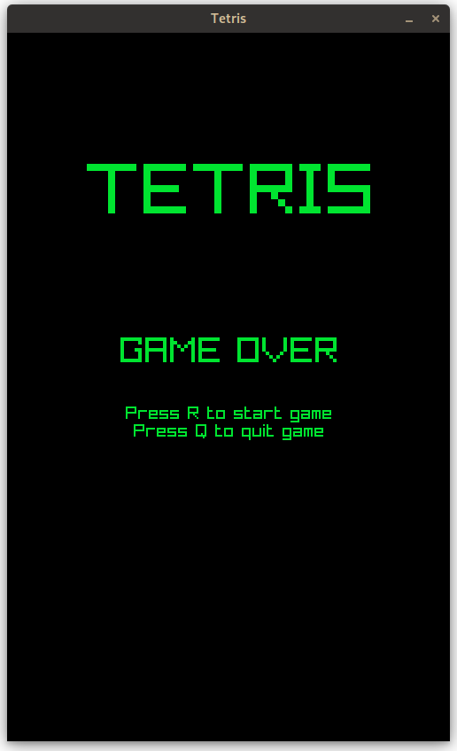
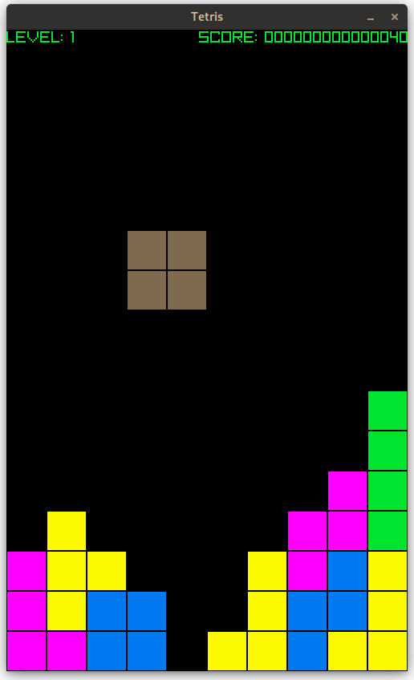

# Tretis

A Tetris clone written in C using [Raylib](https://www.raylib.com/)

## Getting started

```sh
cmake -S . -B ./build
cmake --build ./build
build/apps/tetris
```

## Screenshots




## Links

https://github.com/SasLuca/raylib-cmake-template  
https://gitlab.com/CLIUtils/modern-cmake/-/tree/master/examples/extended-project  
https://cliutils.gitlab.io/modern-cmake/chapters/basics/structure.html  

## Credits

### Music

Song: tetris test korg es-1  
by: Jijiparty  
